### Week 3 : Shallow neural network

## 머신러닝이란 무엇인가??
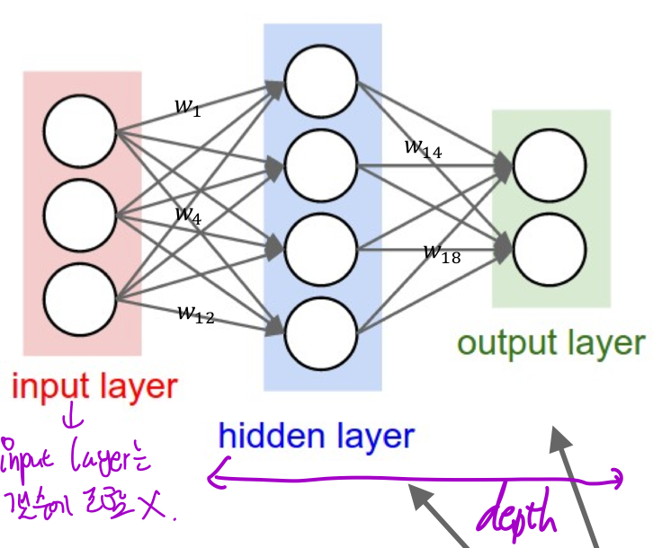
이 사진은 2-layer Neural Net이다. (왜 2-layer냐면 input layer는 세지 않기 때문!)

하나의 동그라미를 Node라고 하는데,node를 확대해서 본다면 얘들은 이러한 일을 하고 있다.

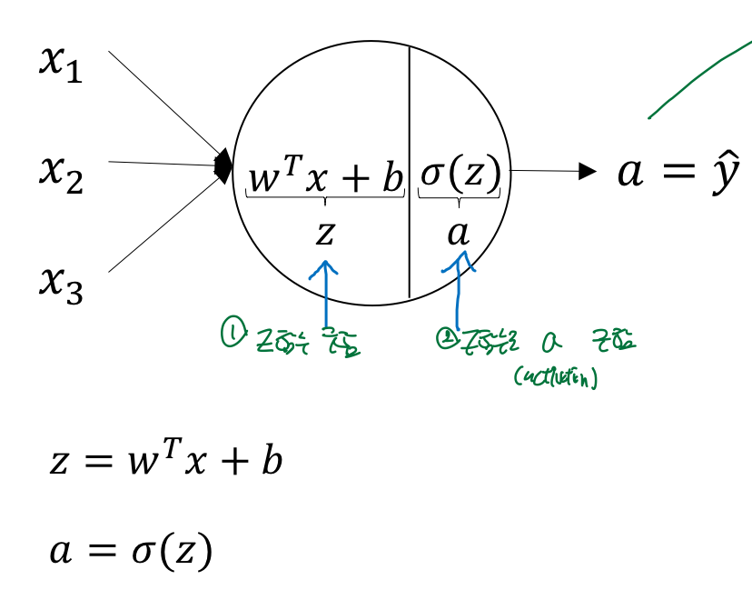
즉, input들을 받아서 W를 곱하고 b를 더해 z를 구한 후, z를 activation 함수에 넣어서 다음 node로 보내주게 된다. 이 과정을 거쳐 output이 나오게 된다.

## Vectorizing?
자! 이것은 one single training example에 대해서만 구한 것이고, 실전에서는 우리들은 수많은 training example들로 이루어져 있는 training set을 학습에 사용하게 된다. 한 layer에 node 하나 뿐만 있는 게 아니라 다수의 node들이 존재한다.

 다수의 training example과 다수의 node들의 계산을 효과적으로 수행하기 위한 것이 바로 vectorizing이다. 

앞선 notation의 정의를 통해 우리는 위첨자 [k]는 k-th layer를, (i)는 training set 내 i 번째 training example을 의미한다고 정의했다.

이를 이용해서 수식들을 vectorizing 시키면 다음과 같다.

training set의 k-th case를 column vector로 이용하여 matrix로 만든 모습이다. 

matrix X의 경우 (input의 종류 x training set의 크기)의 크기를 가지는 matrix이고, A는 (node의 수 X training set의 크기) 가 된다. W는 (output layer의 node r개수  X input layer의 node 개수)가 된다.  차원만 생각해보면 A=WX이므로 차원이 맞다는 것을 알 수 있다.

아무튼, 이렇게 vectorizing해서 하면 iteration을 사용해서 training set을 돌리는 것 보다 훨~씬 빠르고 쉽게 많은 양의 set을 처리할 수 있게된다.(iteration을 조금 쓸수록 속도는 유리해진다!)

아래의 그림으로 정리하자면, vectorizing은 위의 iteration을 없애는 의미가 있다.

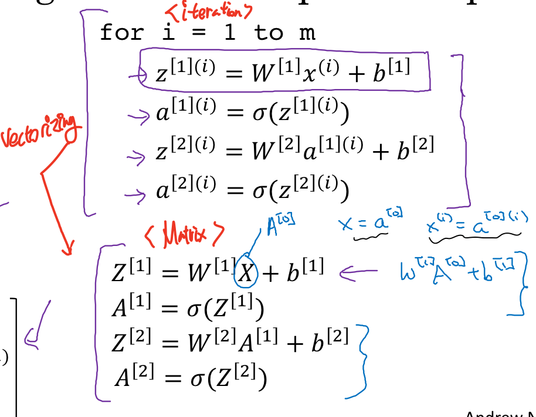

## Activation function?

자, 우리는 앞서, Z=WX+B(위첨자는 신경쓰지 않도록 하겠다. 느낌아니까!)라는 식을 통해 Z를 만들었고, 이것을 다시 activation function인 시그마에 넣어서 다음 layer에 전달해 주었다. 이 활성함수는 왜 사용하는 걸까?

이 의문을 해결하려면 딥러닝이 뉴런을 본따 만들어졌다는 것을 알아야 한다. 본래 뉴런은 여러 경로를 통해 들어온 전기 신호의 합이 일정치 이상이 되면 다음 뉴런으로 신호를 전달하게 된다. 딥러닝에서 이 "일정치 이상의 기준"판단하는 역할이 바로 활성 함수이다. 일정 값 이상이 들어오면 1을 출력하여 다음 뉴런에 값을 전달해주고, 일정 값 이하가 되면 0을 출력하여 다음 뉴런에 값을 전달해 주는 것이다. 

사실 이거를 공부하면서 왜 굳이 활성함수 써야하는데...? 라는 의문이 들어서 더 찾아봤지만, 지금 수준에서는 이해를 못한단다. 인내심을 가지고 강의를 듣다보면 앤드류 응 교수님이 다 설명해주시겠다.

아무튼! 이러한 역할을 하는 활성함수는 종류가 다양하게 있는데, 그것은 아래와 같다.
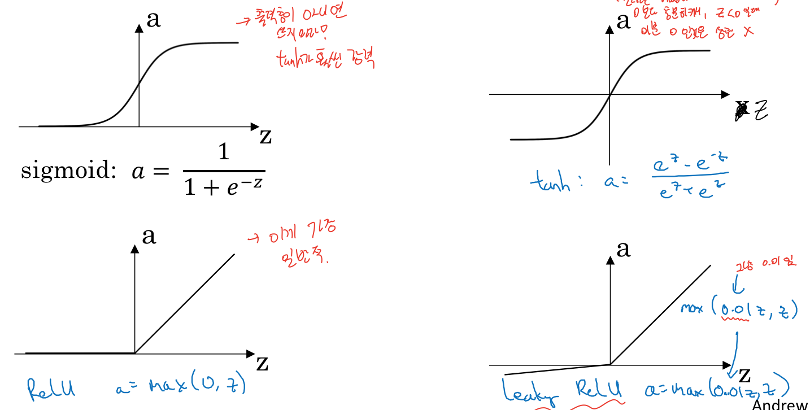

sigmoid와 tanh는 잘 사용하지 않는데, 왜냐하면 값이 양 극단으로 갈경우(x<<<<0 or x>>>>0)일 때 기울기가 거의 0에 가까워서 계산속도가 느려지기 때문이다.
따라서, 요즘 흔하게 쓰는 것은 RELU 혹은 leaky RELU이다.

## Linear activation function?

이 함수들은 모두 non-linear함수이다. 함수가 선형이라면, 선형함수 특유의 성질 때문에 대부분 계산이 쉽게 되어서 선형함수를 매우매우 선호하는 경향이 있다. 그러면, 왜 activation function은 선형이 아닐까?

아래의 슬라이드에서 이유가 밝혀진다!
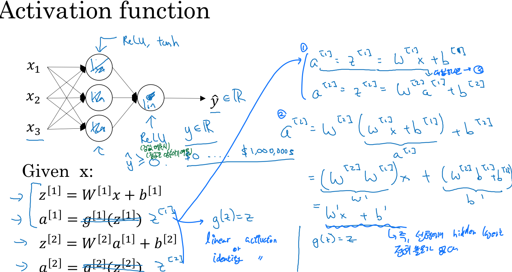

그냥 본론만 말하자면, activation function이 선형이면 hidden layer를 통과해도 값이 변하지 않는다. 따라서 큰 의미가 없고, 우리는 비선형 활성 함수를 사용해야 하는 것이다.

## 딥러닝의 미분?

자, 복습을 해보자. 우리가 딥러닝을 하는 이유는 바로 W1 W2(weight)와 b를 구하기 위해서이다. 요 W를 요래저래 잘 설정해 놓으면 input에 넣었을 때 그 output이 실제와 비슷하게 나오겠죠?

그러면 이걸 어떻게 잘 구하냐가 문제인데, 이때 쓰는 방법이 바로 gradient descent algorithm이였다!기억이 잘 안날거다! 괜찮다! 아래 식이다!

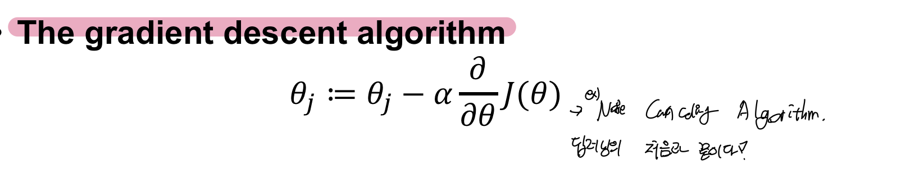
이 식을 쨰려보면, 미분이 있는 것을 볼 수 있다. 그렇다! 우리는 최적화된 W와 B를 구하기 위해서 W와 B로 loss function을 미분한 것을 구해야 한다.

dL/dW = dW임 앞선 강의에서 명시했으므로, dW와 db를 구해보자

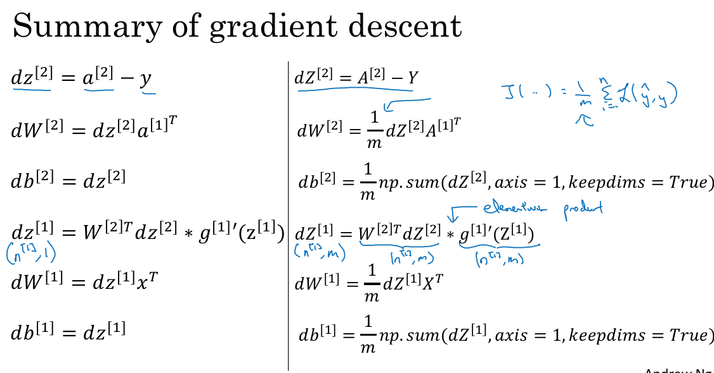

구해보면 위와 같단다. 우리의 딥러닝 고수 앤드류 응 교수님께서 모두 증명해 주셨으므로 나는 결과만 가져왔다.

## Back propagation? 뭘 뒤로가?(optional)

자,앞선 강의에서 forward propagation과 back propagation 이 존재한다는 것을 배웠을 것이다. 이 개념이 헷갈릴 수 있으니(사실은 내가 헷갈렸어서 정리해 보았다!)

forward propagation은 input을 넣고, output으로 나오는 일련의 과정을 의미한다. 
back propagation은 역방향으로, Output에서부터 계산을 시작하는 거다.

아래의 그림에서, 파란색 화살표는 forward, 빨간색 화살표는 back을 의미한다.

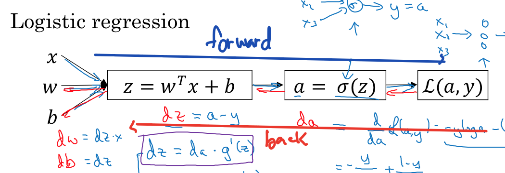

forward를 구하는 것은 논리적으로 이해가 쉽지만, 미분을 구할때는 output에서 부터 시작한는 back propagation을 써야한다.

그 이유는 chain rule 때문인데, 현재 layer에서의 미분을 구하려면 다음 layer에서의 미분 값이 필요하기 떄문이다. 아래 그림을 보면 이해가 쉽다.

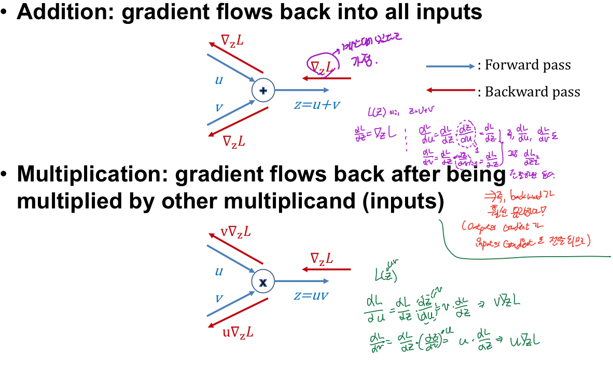
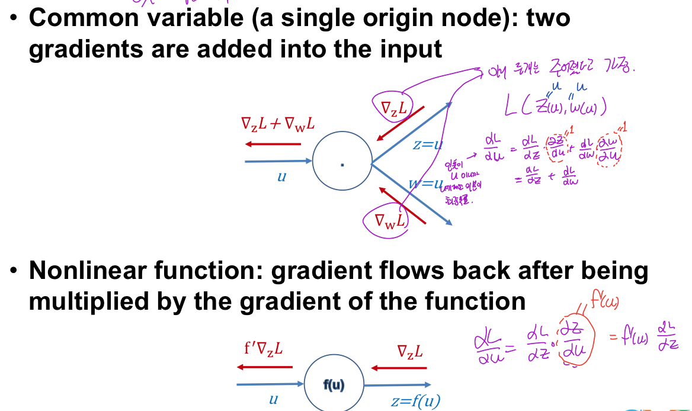
(와! 진짜 열심히 발제한다! 박수!)

파란색은 forward이고 빨간색은 backward이다. 요 네 개의 경우를 보면, 이전 단계의 미분(u,v)를 계산하는 과정에서 다음 단계의 미분을 사용하고 있다(dz) 이것을 보면, 다음단계의 미분을 먼저 계산하고 이전 단계의 미분을 계산하는 back propagation의 장점을 알 수 있다.

## 간단한 예로 감을 잡아보자.

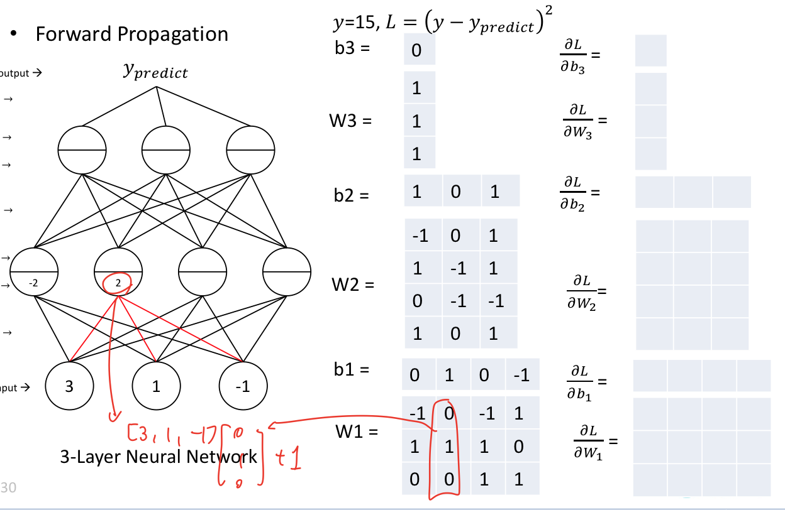

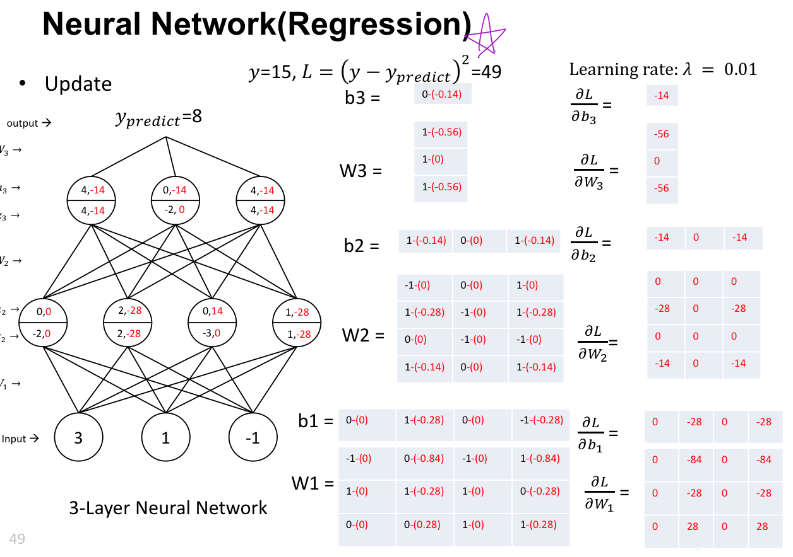
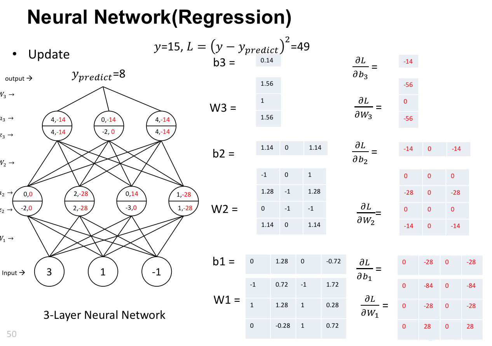

이것들은 수업에서 가져온 자료들인데, 이걸보고 그래도 감이 잡혀서 가져왔다!