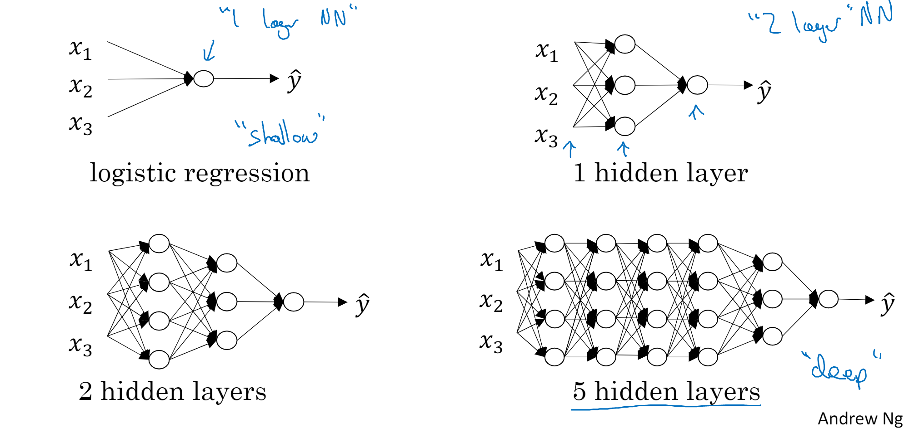
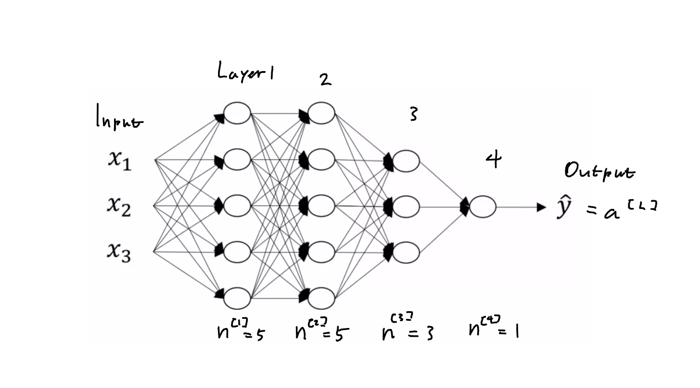
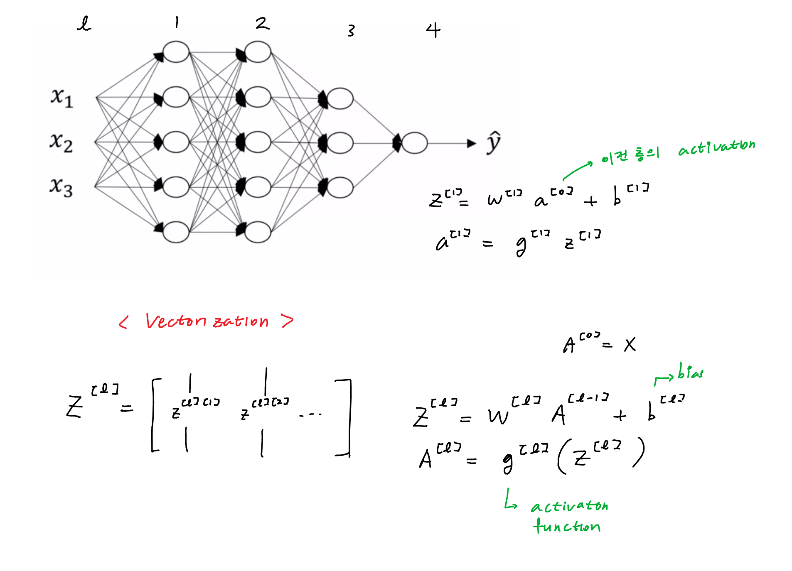
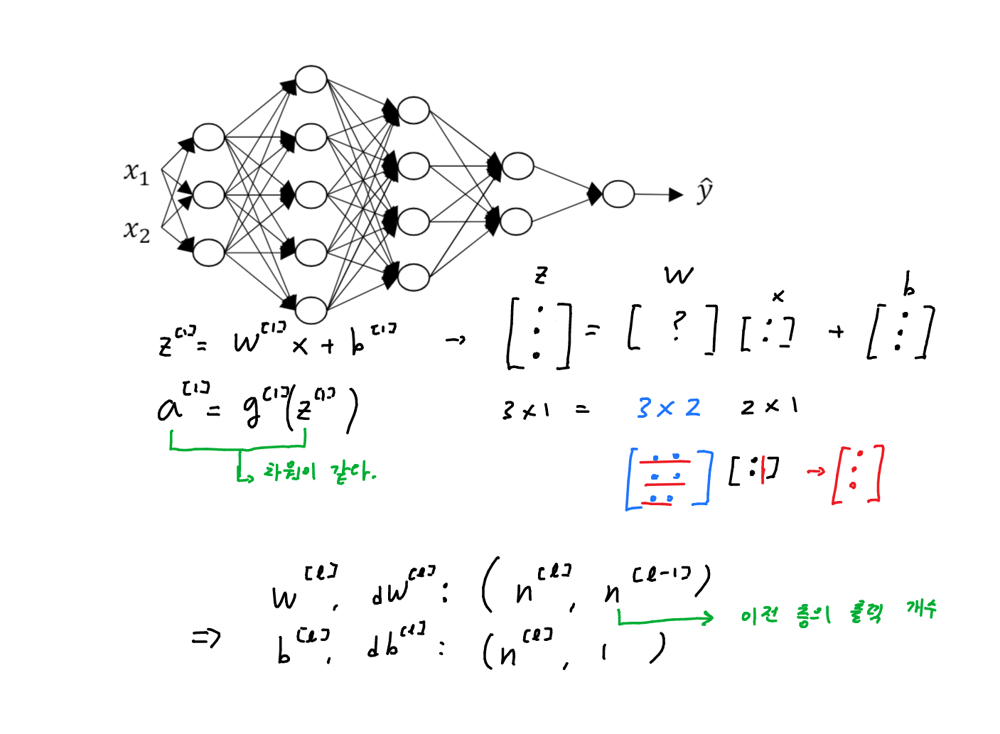
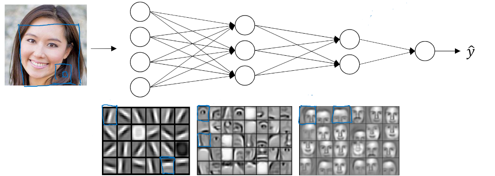
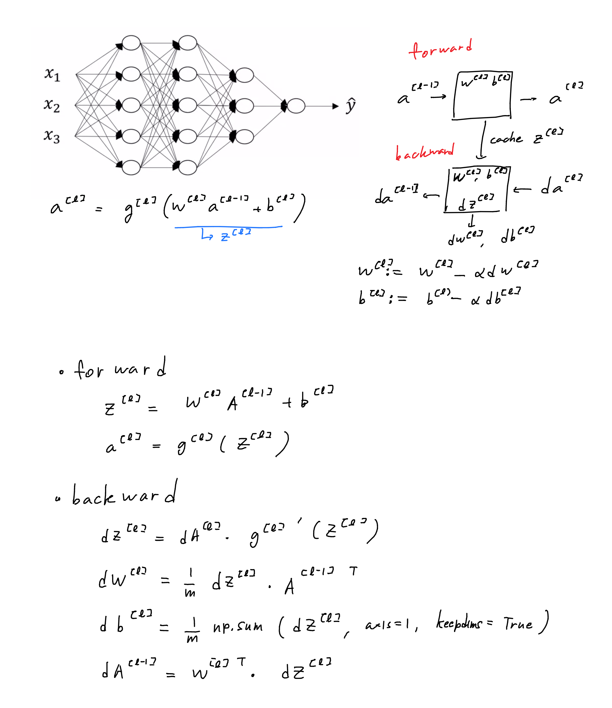
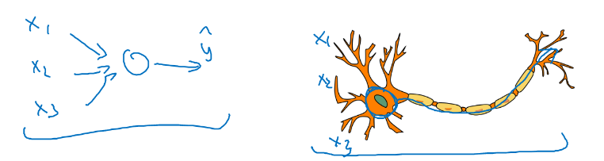

# Week 4. Deep Neural Network

by | 상원 
pub date | 2020.10.17.Sat

### Deep L-layer Neural network

단순한 perceptron으로 이루어진 hidden layer 를 여러 층 쌓기 때문에 Deep neural network 라고 한다!

### Notation

위는 4 layer NN (L = 4)

- n[l] = # of units in layer l
- a[l] = activation in layer l
- w[l] = weight for z[l]
- b[l] = bias for z[l]

### Forward Propagation

for 문을 사용할 것 같다. 그러나 for 문보다 훨씬 빠른 방법을 써야한다. -> Vectorization

[왜 vectorization 이 더 빠른가](https://stackoverflow.com/questions/35091979/why-is-vectorization-faster-in-general-than-loops)

### Getting your matrix dimensions right 행렬의 차원 맞추기!

### Why deep representations? Why  does it work well?

 

1. ##### 복잡한 feature 를 뽑아내기 좋다.

   층을 쌓아갈 수록 각각의 hidden layer 가 내포하는 정보가 **단순한 feature -> 복잡한 feature** 로 변한다.

   edge -> eyes -> face  이런식으로

2. ##### 기하급수적으로 parameter 가 늘어나는 것을 방지한다

   XOR 계산을 하는 신경망을 예로 들었을 때, input 의 개수가 n이라면

   한층짜리 신경망이라면 계산의 시간 복잡도가 O(2^n)

   다층 신경망에서는 O(log n)

3. ##### 이름이 멋있다.

   모든 경우에 다 Deep Neural Network 가 필요한 것은 아니다.

   물론 무작정 신경망을 깊게 하면 좋은 결과를 내는 것이 최근의 트렌드이지만, 얕은 신경망에서 시작해서, 점차 레이어를 늘려나가는 것이 바람직하다.

### Building blocks of deep neural networks, Forward and Backward Propagation

cache 에는 Z W b 모두 저장, 역전파 계산을 용이하게 한다. -> 동적 계획법?

- 이 부분이 사실 가장 어려운 부분
- 그러나 keras 나 pyTorch 에서는 이런 계산들을 용이하게 하는 툴을 제공한다
- 실제로 코드는 그리 길지 않다 -> 실습 따라하며 감을 익히자!
- 딥러닝 알고리즘에서 제일 중요한 것은 데이터! 

### Parameters vs Hyperparameters

- **Parameters**: 연산(backprop) 중에 변하는 계수들

  ex) W[1] b[1] 

- **Hyperparameters**: 처음에 설정하는 초기값, 파라미터를 결정하는 파라미터

  ex) learning rate, iterations, hidden layer L, choice of activation function ...

> 적절한 Hyperparameter 의 값? 알 수 없다
>
> 따라서
>
> 아이디어 -> 코드 -> 실험 -> 아이디어  ... 반복하며 다양한 값들을 시도

### What does this have to do with the brain

일단 사람 두뇌와 비슷하다고 하면 현혹된다. 그러나 이건 지나치게 단순한 표현

각각의 perceptron 은 뉴런과 구조가 비슷하다

그러나 신경 세포는 생각보다 훨씬 복잡하다. 신경학자들도 메커니즘을 잘 모른다.

신경세포가 backprop 을 쓰는지, 완전 다른 메커니즘을 쓰는지 알 수 없다.

컴퓨터 비전은 그래도 두뇌로부터 영감을 조금 더 얻었다. -> CNN에서 추가로 설명

