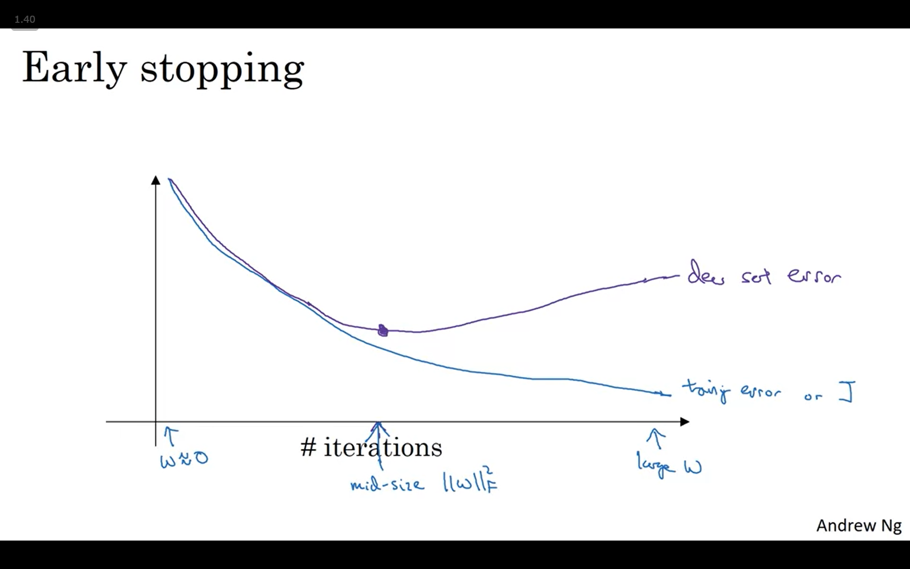
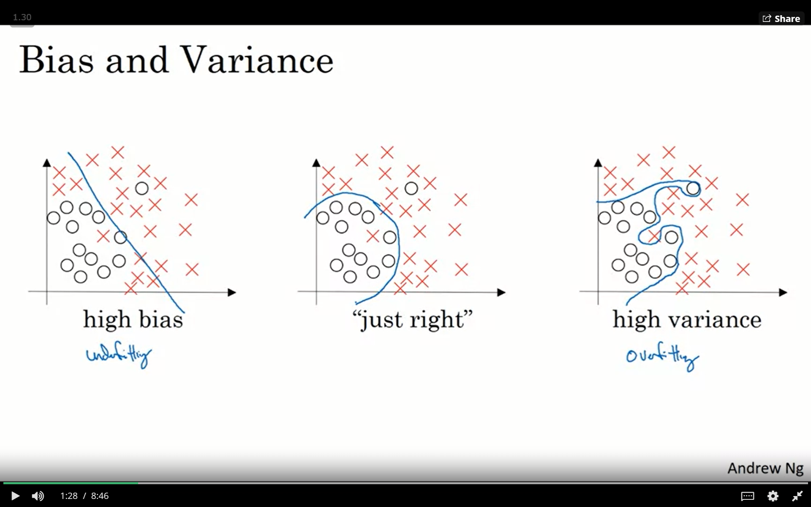
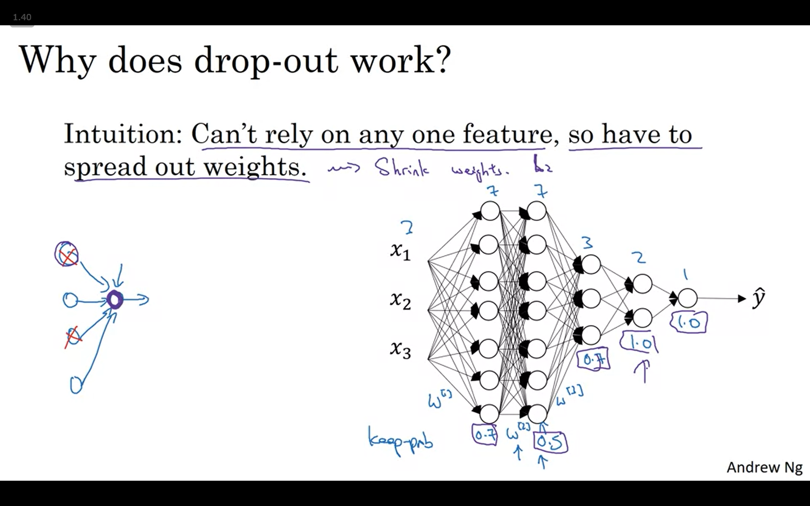
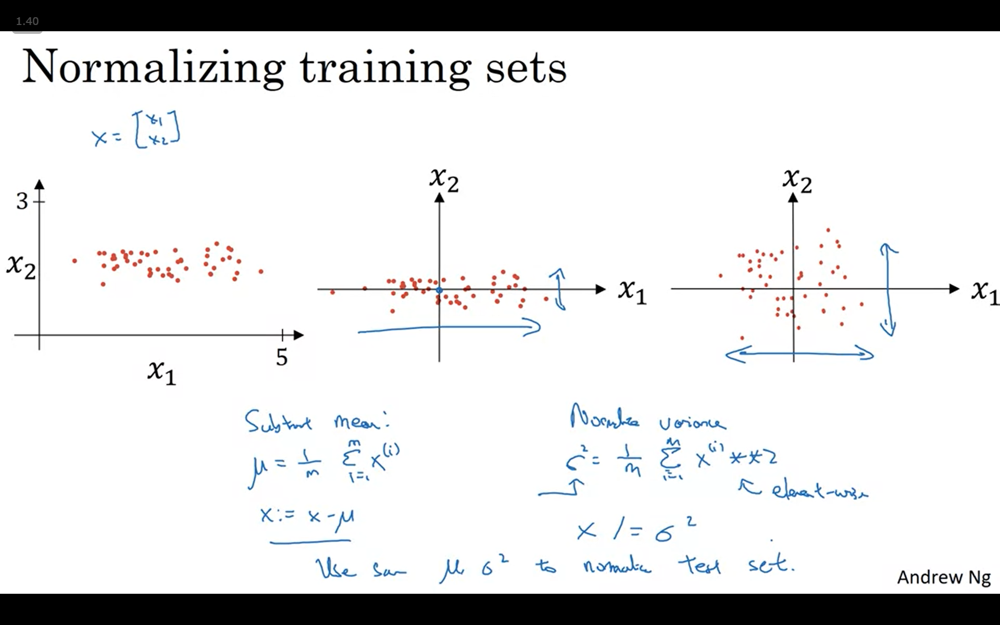
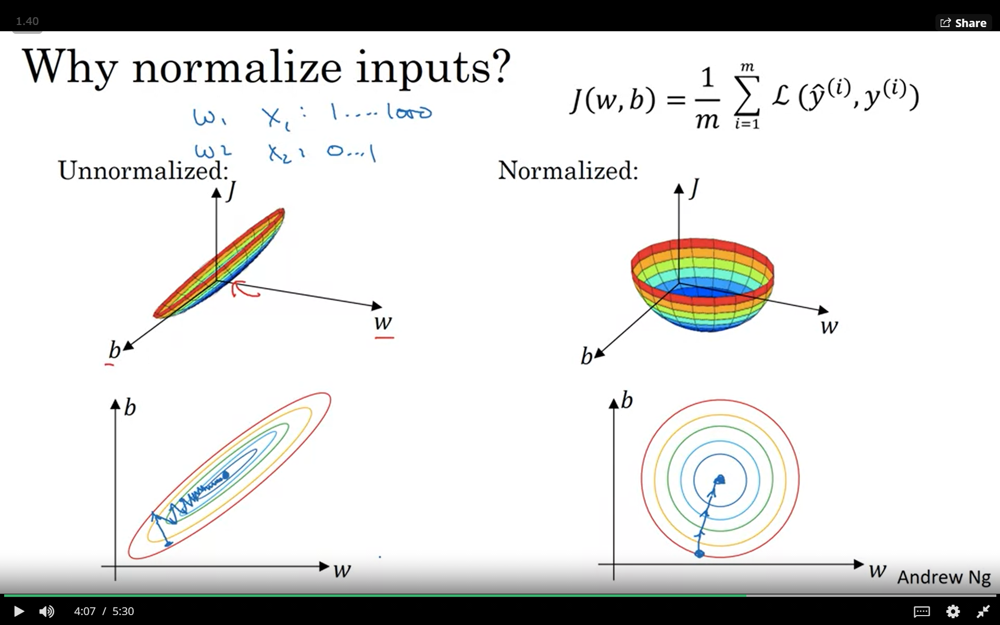
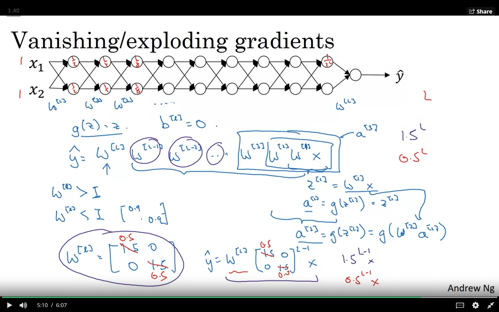
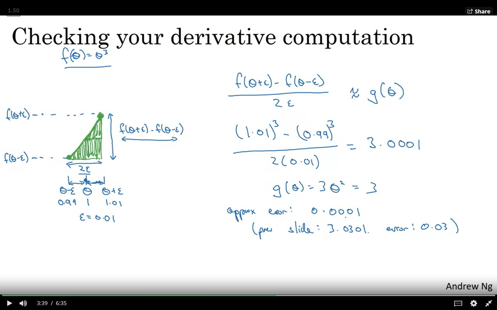
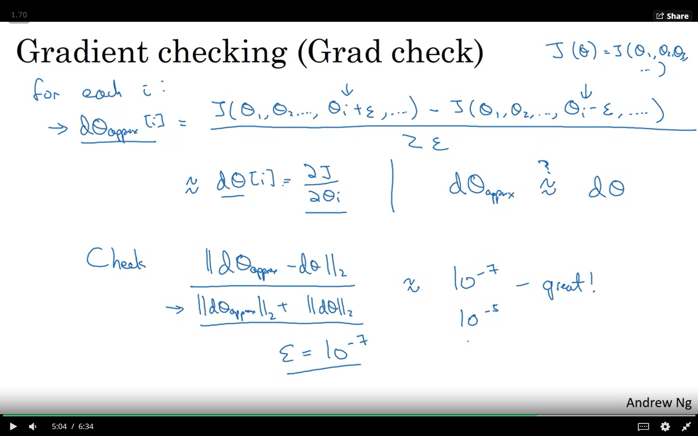

<!-- omit in toc -->
## 목차
- [1. 강좌 목표](#1-강좌-목표)
- [2. Data](#2-data)
  - [2.1 Data 종류](#21-data-종류)
  - [2.2 Bias & Variance](#22-bias--variance)
- [3. Regularization](#3-regularization)
  - [3.1 Frobenius method](#31-frobenius-method)
  - [3.2 Drop-out method](#32-drop-out-method)
  - [3.3 Data augmentation](#33-data-augmentation)
  - [3.4 Normalizing training sets](#34-normalizing-training-sets)
  - [3.5 Vanishing/Exploding gradients](#35-vanishingexploding-gradients)
  - [3.6 Gradient Checking](#36-gradient-checking)

## 1. 강좌 목표
- 지금까지 neural network의 구조에 대해서 배웠다. 적절한 layer의 수, 각 layer의 node 수, learning rate의 값, activation function을 어떻게 설정할 수 있을까라는 의문이 생긴다. 우리가 backpropagation을 통해서 수정하는 것은 W와 b 뿐이었기에 얘네는 처음에 잘 설정해야한다.
- 딱히 방법은 x. 대신에 iteration을 효율적으로 돌리는 방법들에 대해서 배운다.

## 2. Data
### 2.1 Data 종류
- Data가 주어져있을 때 크게 training data set, Development set(Dev set), test set으로 구분한다. Dev set은 특정 알고리즘, 혹은 model이 얼마나 잘 맞는지 test하기 위한 set. 

 1. 검색 결과 각 iteration마다 training set을 이용해 모델을 훈련. 
 2. iteration이 끝날 때마다 dev set에 대해 model을 test 해본다? 
 3. dev set에 대한 accuracy가 점점 늘다가 줄어드는 순간 학습을 종료한다. (early stopping)
- 내 생각 : iteration이 진행될 때마다 우리의 모델은 해당 training set에 대해 더 높은 정확도를 가지는(loss가 작은) model로 학습이 된다. 하지만 이걸 계속하다보면 training set에만 특화된 모델이 되어 다른 data가 들어왔을 땐 잘 처리하지 못할 수 있다. 그래서 학습하는데 사용하지 않은 dev set으로 매번 테스트하는 것 같다... 
- 옛날엔 비율을 60/20/20 정도로 나누었는데 data의 양이 늘어나면서 98/1/1처럼 training set에 더 높은 비중을 둔다.
- dev와 test set은 같은 distribution으로부터 온 data이어야 한다. (이건 정확히 이해를 하지 못했음. 왜 training set은 달라도 되는가.)
### 2.2 Bias & Variance

- High bias = underfit model
- High variance = overfit model
- Train set error의 값이 크면 bias가 크다.
- Train set error에 비해 dev set error의 값이 크면 variance가 크다. 
- 얘네를 줄이는 것이 목표.
- sol for High Bias
  
  1. Bigger network.
  2. train longer
  3. new architecture

- sol for High Variance
  
  1. use more data
  2. **regularization**
  3. new architecture

## 3. Regularization
### 3.1 Frobenius method

- High Variance (overfitting)을 해결하기 위한 방법
- 기존의 loss function을 변형. weight의 모든 element를 제곱해서 더한 항이 추가되었다.
- 새 loss function을 gradient descent에 사용해보니 w에 비례하는 항이 추가로 빼지는 것이 관찰된다. => Weight Decay
- Weight Decay가 빨라진다 => 극단적으로 0으로 근사해버리면 몇몇 node의 영향력이 사라진다 => 마치 netwokr의 사이즈가 줄어들어 simple network처럼 취급이 가능해진다. => simple 해지면서 덜 overfit 해질 것이다.
### 3.2 Drop-out method

- overfit 없애기 위한 또 다른 방법. network를 simple하게 만들기 위해 random하게 iteration마다 몇몇 node를 삭제한다. 
- random하게 숫자를 생성해서 keep-prob보다 작으면 그대로 두고 크면 0으로 weight를 바꾸어 버린다. 
- Z = W A + B
- keep prob가 0.8이어서 A layer에서 20%의 node가 사라졌다면 Z의 크기는 20% 줄 것이다. node의 삭제로 인해 다음 layer의 값이 바뀌는 것을 방지하기 위해...
- A = A/keep-prob 를 해준다.
- random하게 없애기 때문에 굉장히 wild하고 막무가내처럼 보이지만 효과적인 이유는? 
- Weight의 값이 spread된다... 하나의 node에 의존해서는 안 되기 때문에. => weight의 크기가 줄고 Frobenius method에서처럼 simpler network가 된다.
- 의문: 낮은 확률이지만 특정 iteration에서 한 layer의 node가 모두 사라진다면? 해당 iteration 한정 loss function이 input에 영향을 받지 않는다. 학습에 영향을 주지 않을까.
### 3.3 Data augmentation
- data가 많을수록 model의 성능은 올라간다. 하지만 data를 구하기 어렵다면... 
- 현재 가지고 있는 data에 distortion을 주고 새 data로 추가한다.
- 고양이 사진을 확대하거나 회전시켜서 추가.

### 3.4 Normalizing training sets

- X = X - u
- 좌표변환된 X는 평균이 0이다. 평균을 빼주었기 때문에.
- X = X / (sigma)^2
- 나누어도 평균은 안 변해서 여전히 평균은 0. variance는 1로 바뀐다. 

- 만약 X1, X2의 range가 크게 차이나서 X1, X2의 분산이 차이가 크면 긴 타원형의 모양을 얻을 것이다.
- gradient descent를 적용하기 위해서 상대적으로 더 낮은 learning rate를 설정해야해서 효율성이 떨어진다.  
### 3.5 Vanishing/Exploding gradients

- 만약 activation function g(z) = z로 linear function이라면...
- W를 대각행렬이라고 할 때 W가 X에 계속 곱해지면서 y가 된다. model이 굉장히 deep하다면 y가 매우 작아지거나 매우 커질 것이다. 

- sol) node의 수인 n이 증가할수록 weight의 값을 작게 설정해준다.
- 이해못한 점) 중요한건 node의 수가 아니라 layer의 수 아닌가? 그리고 크기를 작게 해주고 싶은데 왜 variance를 2/n으로 해주는가?
### 3.6 Gradient Checking

- back-propagation이 잘 되었나 확인하는 방법
- 미분은 극한으로 정의된다. 한 점에 대한 정보뿐 아니라 근방의 정보도 알아야 기울기를 구할 수 있다. dx를 2dƐ으로 잡으면 왜 정확도가 높아지는가.
- 수식적으로 보았을 때 위쪽 삼각형, 아래쪽 삼각형에서 구한 기울기 값을 평균 낸 것이기 때문에.

- 모든 W, b를 reshape하여 하나의 큰 vector theta를 만든다. 
- loss function J는 이제 theat에 대한 식. theta의 i번째 component에 dƐ만큼 변화가 생긴다면...dtheta[i] 구할 수 있다.
- 이것을 backpropagtion으로 구한 loss와 비교. 차이가 크다면 차이가 크게 발생한 layer를 쳐다보면 실수가 보인다.
  