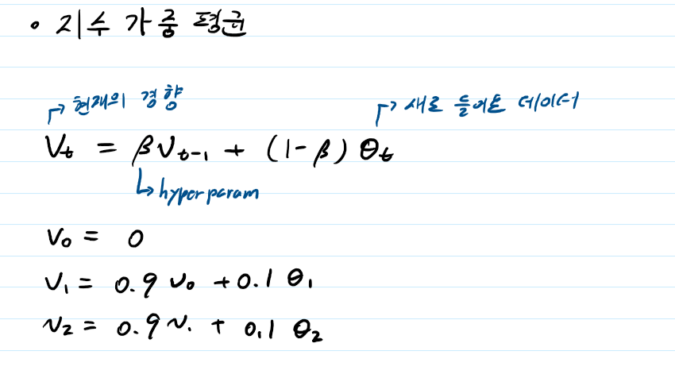
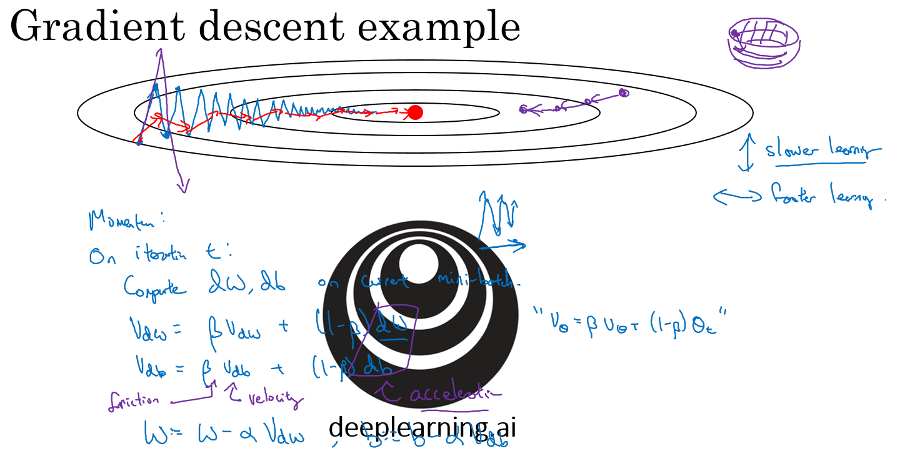

# Week 6

## Mini-batch gradient descent


- 수백만개를 하나씩 학습시키면, 학습이 너무 오래 걸린다.
- 따라서, 한번에 모든 데이터를 학습시키지 말고, 작은 단위의  batch마다 gradient descent 가 일어나게 하자 학습을 차근차근 시키자
  - 예를 들어, 1000개의 데이터를 batch_size=10 으로 넘겨준다면
  - 100 step 만에 1 epoch 를 돌 수 있다.
- Vectorization 을 통해 효율적인 계산이 가능하다.


## Understanding mini-batch gradient descent

**stochastic gradient descent** VS **batch gradient descent**

- vectorization 에서 속도 저하, 트레이닝 샘플을 하나씩 처리하므로
- 적절한 크기의 mini batch size 를 설정하는 것이 중요
- 벡터화를 통해 처리 속도를 늘리자!


작은 트레이닝 셋( 2000개 이하 ) 

- 그냥 batch gradient descent

트레이닝 셋이 크다면 

- 64 ~512 크기의 배치 사이즈를 이용
- 배치 사이즈는 2의 지수값을 가질 때 더 빨리 실행된다 -> 왜?
- 그러나 RAM 또는 VRAM 이 허용할 만큼 크기가 충분히 작아야한다. 일반적인 VRAM size 는 4 - 11GB
- 이 때문에 multi GPU 를 이용


## Exponentially weighted averages



- 데이터의 이동 평균을 구할 때, **오래된 데이터**가 미치는 영향을 **지수적으로 감쇠**하도록 만들어주는 방법!

- 시간이 지날 수록 오래 전 입력 값의 영향이 줄어든다
- 모든 데이터를 메모리에 저장하는 것보다 메모리 부담이 준다 -> markov matrix?


## Bias correction in exponentially weighted averages


- 초기 값이 정확하지 않은 문제를 해결하기 위함
- 그러나 t가 충분히 크다면 크게 상관 없음


## Gradient descent with momentum




- 위에서 배운 Exponentially weighted average 를 gradient descent 에 적용
- 최신 기울기들이 더 크게 반영되도록 한다!
- descendent gradient method 보다 항상 더 빨리 동작


## RMSprop


```python
# Stochastic Gradient Descent
def SGD():
    w, b = init_w, init_b
    
    for i in range(max_epochs):
        dw, db = 0, 0
        
        w = w - (learning_rate * grad_w(w, b, x, y))
        b = b - (learning_rate * grad_b(w, b, x, y))
```

```python
# RMSProp
def do_rmsprop():
    w, b, eta = init_w, init_b, 0.1
    v_w, v_b, beta, eps = 0, 0, 0.9, 1e-8
    
    for i in range(max_epochs):
        dw, db = 0, 0
        for x,y in zip(X,Y):
            dw += grad_w(w, b, x, y)
            db += grad_b(w, b, x, y)

        v_w = beta * v_w + (1 - beta) * dw**2
        v_b = beta * v_b + (1 - beta) * db**2

        w = w - (eta/np.sqrt(v_w + eps)) * dw
        b = b - (eta/np.sqrt(v_b + eps)) * db
```


```python
tf.keras.optimizers.RMSprop(
    learning_rate=0.001, rho=0.9, momentum=0.0, epsilon=1e-07, centered=False,
    name='RMSprop', **kwargs
)
```

https://github.com/tensorflow/tensorflow/blob/v2.3.1/tensorflow/python/keras/optimizer_v2/rmsprop.py#L35-L298


## Adam optimization algorithm

- exponentially weighted averages


- bias-correction

  

```python
# Adam
def do_adam():
	w, b, eta, max_epochs = 1, 1, 0.01, 100, 
    m_w, m_b, v_w, v_b, eps, beta1, beta2 = 0, 0, 0, 0, 1e-8, 0.9, 0.99
    
	for i in range(max_epochs):
		dw, db = 0, 0
		for x,y in data:
			dw += grad_w(w, b, x, y)
			db += grad_b(w, b, x, y)
		m_w = beta1 * m_w + (1-beta1) * dw
		m_b = beta1 * m_b + (1-beta1) * db
		
		v_w = beta2 * v_w + (1-beta2) * dw**2
		v_b = beta2 * v_b + (1-beta2) * db**2
		
		m_w = m_w/(1-beta1**(i+1))
		m_b = m_b/(1-beta1**(i+1))
		
		v_w = v_w/(1-beta2**(i+1))
		v_b = v_b/(1-beta2**(i+1))
			
		w = w - eta * m_w/np.sqrt(v_w + eps)
		b = b - eta * m_b/np.sqrt(v_b + eps)
```


```python
tf.keras.optimizers.Adam(
    learning_rate=0.001, beta_1=0.9, beta_2=0.999, epsilon=1e-07, amsgrad=False,
    name='Adam', **kwargs
)
```

https://github.com/tensorflow/tensorflow/blob/v2.3.1/tensorflow/python/keras/optimizer_v2/adam.py#L34-L252


기타 여러가지 optimizer 에 관한 [이 사이트를](https://hiddenbeginner.github.io/deeplearning/2019/09/22/optimization_algorithms_in_deep_learning.html#Adam) 참고해도 좋을 것 같다!


## Learning rate decay


- 학습이 시작되었을 때는 local minima 에 빠지지 않기 위해 크게크게 건너뛰어야한다.
- 이후, 학습이 진행됨에 따라 learning rate 를 점점 감소시켜야 우리가 원하는 minima 에 도달할 수 있다
- 아래는 텐서플로에서 쓰이는 learning rate 코드 예제, exponential_decay 를 설정 가능

```python
global_step = tf.Variable(0, trainable=False)
starter_learning_rate = 0.1
learning_rate = tf.train.exponential_decay(starter_learning_rate, global_step,
                                           100000, 0.96, staircase=True)
# Passing global_step to minimize() will increment it at each step.
learning_step = (
    tf.train.GradientDescentOptimizer(learning_rate)
    .minimize(...my loss..., global_step=global_step)
)
```


## The problem of local optima


- 2차원으로 간단히 표현했는데, 매우 많은 local minima 가 존재
- 우리가 원하는 Goal 에 도달하기 위해서 learning rate decay 등을 사용
- 고차원에서는, saddle point 에서 효과적으로 빠져나오지 못하는 경우가 있음
- 이 때, Adam 이나 RMSProp 등이 빠져나올 수 있도록 도와줌


## 실습(?)


https://www.tensorflow.org/tutorials?hl=ko

