**Convolutional Neural Network(CNN)** 

: 이미지 인식 알고리즘

- 기본 용어 정리

**1. Convolution (합성곱)**

   `합성곱 연산은 두 함수 f, g 가운데 하나의 함수를 반전(reverse), 전이(shift)시킨 다음, 다른 하나의 함수와 곱한 결과를 적분하는 것을 의미한다. (by wikipedia)`

   => 이미지를 조각내서 인식

   

**2. Convolution operation**

   입력된 데이터를 지정된 간격으로 순회하면서 채널별로 합성곱을 하고, 모든 채널(컬러는 3개)의 합성곱의 합을 Feature Map으로 만든다. 

   + Input * Filter => Feature Map(Activation Map)

   Edge Detection (vertical, horizontal)

   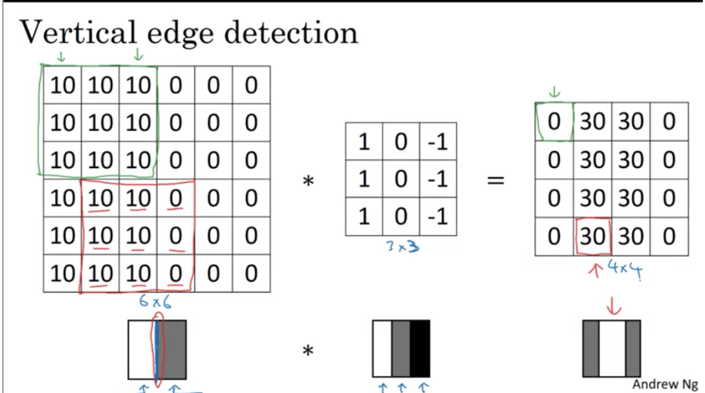

   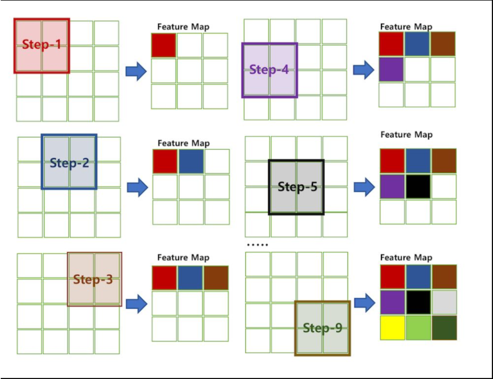

**3. Filter (Kernel)**

   filter 를 사용해서, 이미지의 특징을 detect한다. 

   일반적으로 정사각이며, 보통 1x1, 3x3, 5x5 등의 홀수가 좋다(by 앤드류님) 

**4. Stride**

   지정된 간격으로 건너 뛰며 합성곱을 구한다.     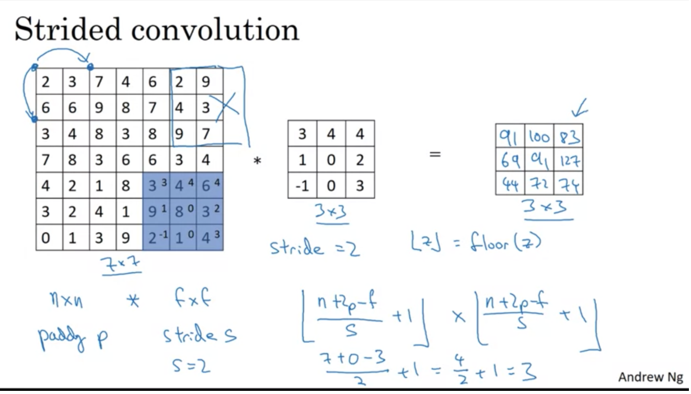

**5. Padding**

   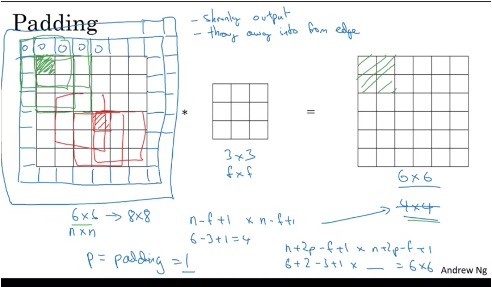

   + Output size와 input size가 같도록 만들기 위해서 padding을 한다.

   +  padding을 하는 이유? 이미지 크기가 계속 줄어들면, layer를 거치면서 계속 작아지는 문제 + 가장자리의 data들이 손실되는 문제

   **Valid Convolution** : padding이 없는 것 n-f+1 x n-f+1 

   **Same Convolution** : padding 존재 n+2p-f+1x n+2p-f+1

=> Summary 

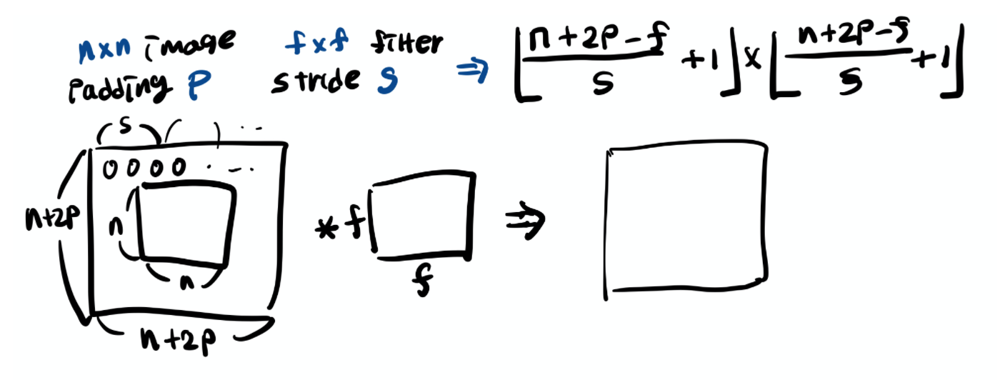

**6. Channel**

   3차원 이상의 volume에서 3번째 dimension의 사이즈를 가리킨다(3D 볼륨의 깊이)

   **nxnxnC(channel의 수) + fxfxnC = n-f+1 x n-f+1 x nc'(filter의 수)**

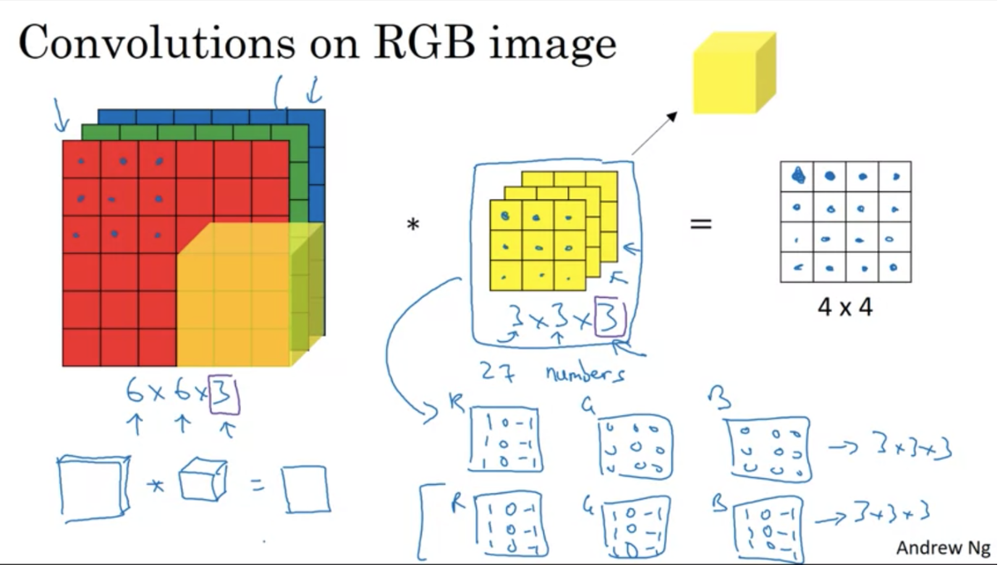

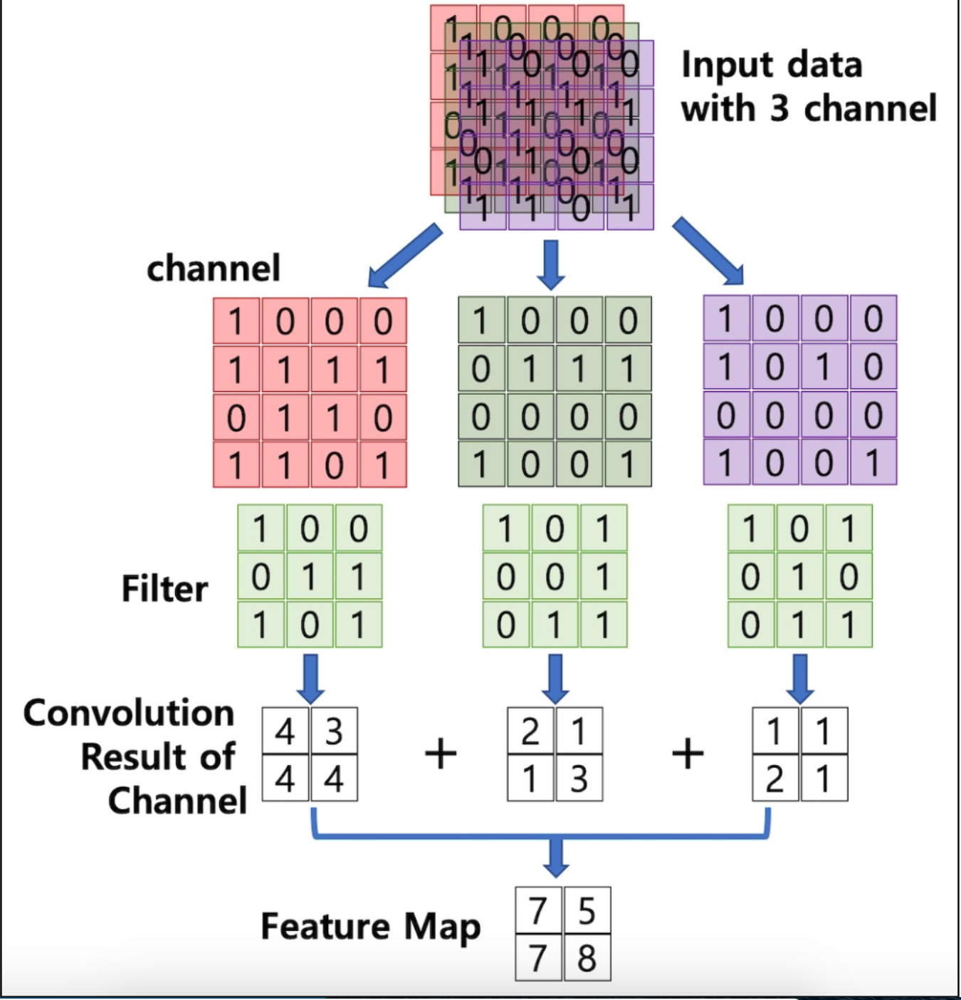

​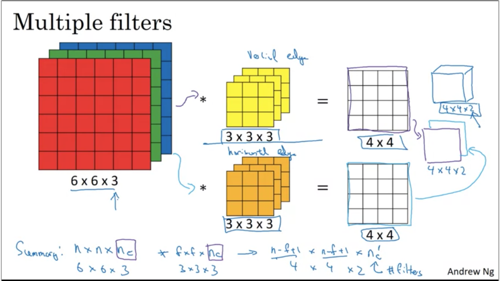

**Example**

​z[1] = w[1]a[0] + x[1]    ( a[0] <---- x)

a[1] = g(z[1])    (activation of next layer)  a[0] (6x6x3) => a[1] (4x4x2)

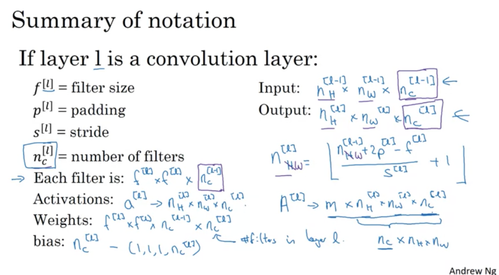

각각 하나의 filter는 f[l]xf[l]xnC[l-1]이고  weights(가중치, w parameter)는 여기에 filter의 수 nC[l]만큼을 곱해준 값이 된다. bias는 4차 행렬 로 (1, 1, 1, nC[l])로 표현한다. 

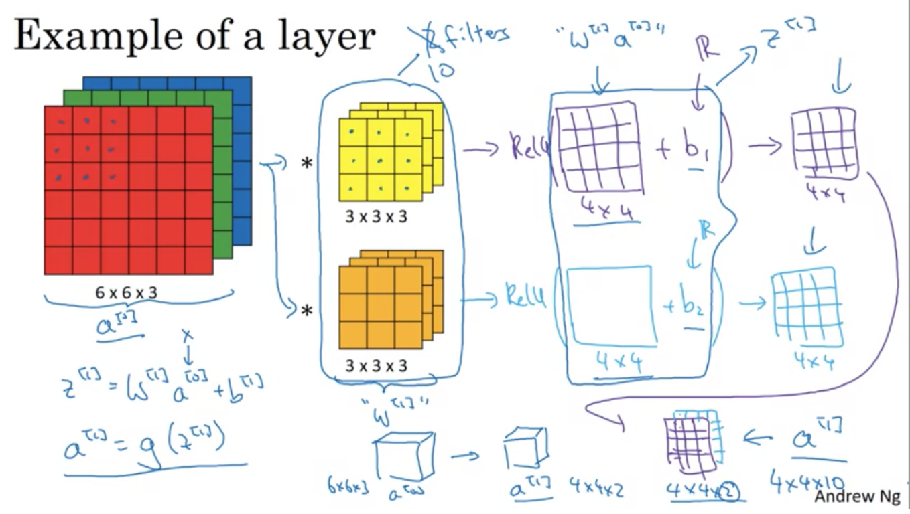

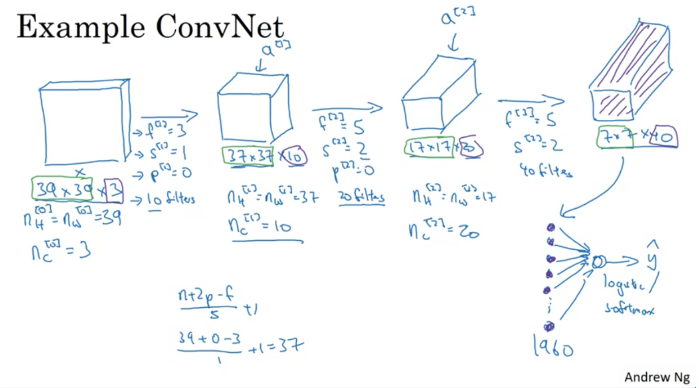

=> 39x39x3 => 7x7x40 (1960)

=> 이 조각들을 벡터로 전개한 다음 로지스틱 logistic regression 혹은 softmax 단위로 ouput 표기

**7. Pooling Layers**

+ Convolution layer의 output data를 입력으로 받아서 출력 데이터(Activation Map)의 크기를 줄이거나 테이터를 강조하기 위한 용도로 사용된다. 

  + Max Pooling => 최대값(각 channel별로 독립적으로 계산)!   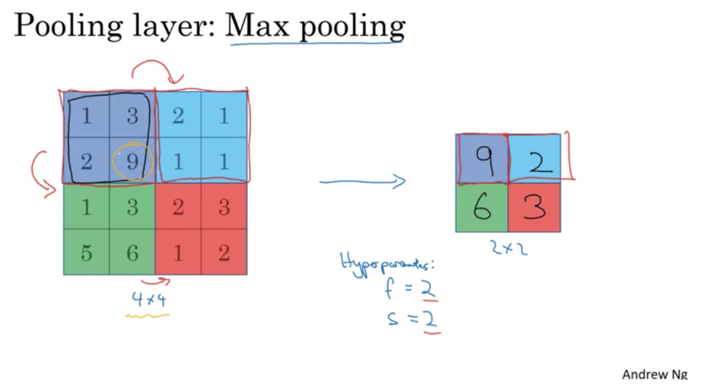

   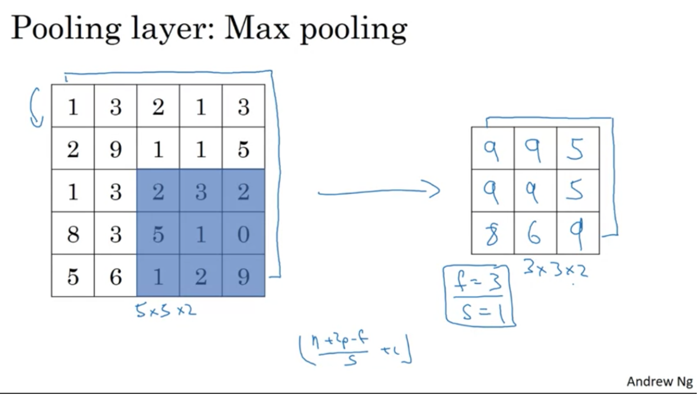

  + Average Pooling => 평균값

   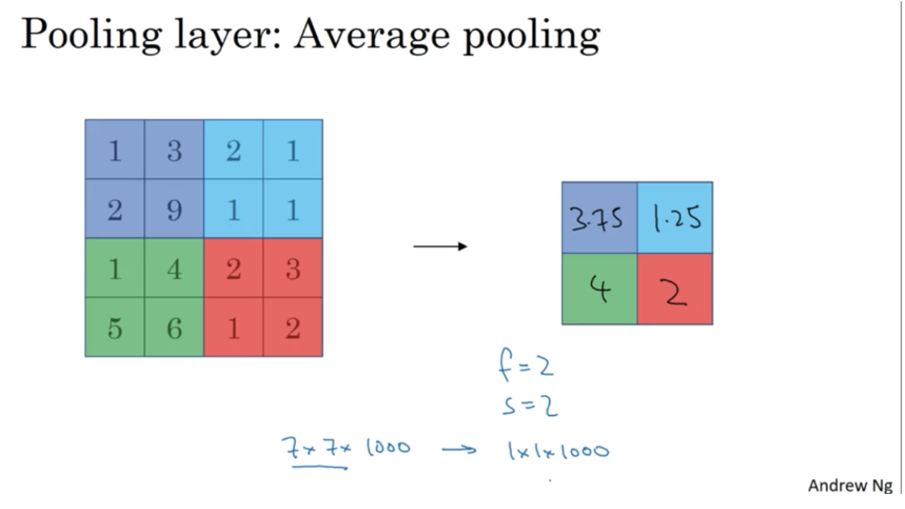

    + 학습 대상 파라미터가 없다! 

    + layer를 거치면서 행렬의 크기가 줄어든다. 
    + layer를 거칠 때 channel의 수에는 변화가 없다. 

   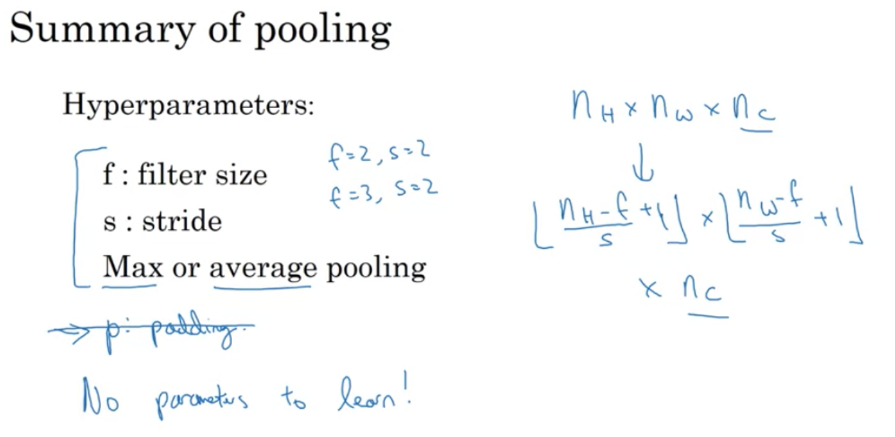

  - max pooling은 대개 padding을 사용하지 않는다. 

  - No parameter to learn!!! 계산을 위해 fix된 함수일 뿐, 배울 게 없다. 

    

**Convolutional network**

- Convolution (Conn)
- Pooling (Pool)
- Fully connected (FC)

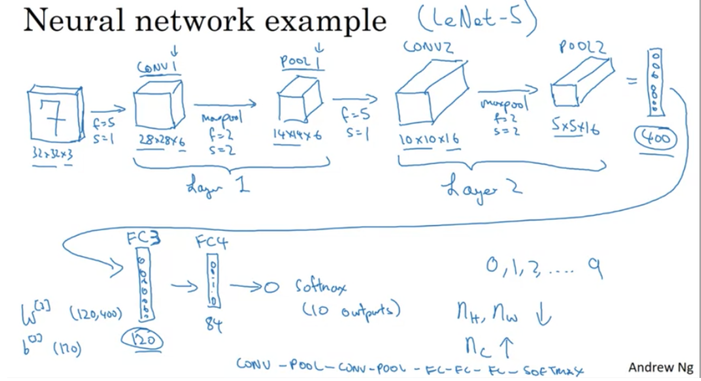

+ 32x32x3 => 5x5x16(400)을 120조각에 개별적으로 fully connected된 가중치 매트릭스를 가진 표준 신경망이 된다. (W[1] (120, 400) ) 그리고 softmax로 표시

+ CONN , POOL => FC => Sofmax 
+ Nh Nw 는 감소하는 반면 Nc 는 증가

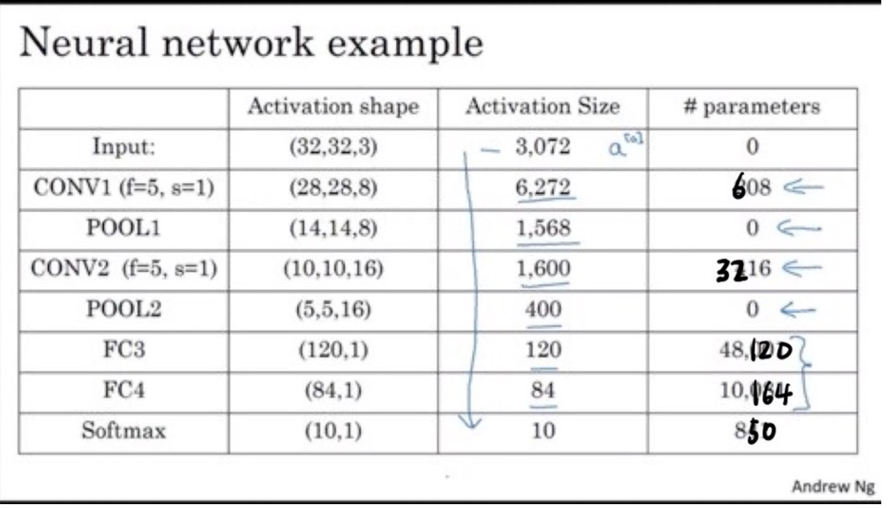

+ max pooling layer는 parameter를 가지지 않는다. 

+ activation size는 신경망 안으로 깊게 진행될 수록 줄어든다. 
  

**Convolutions의 장점**

1. Parameter Sharing: vertical edge detector와 같은 feature detector에서 처럼 3x3 필터를 적용한 다음에 그 다음에 다시 또 계산에 사용되는 등, 적은 수의 파라매터를 사용한다. 

2. Sparsity of connections: 각 layer에서 각각 output 값은 작은 인풋값에 의존한다. 

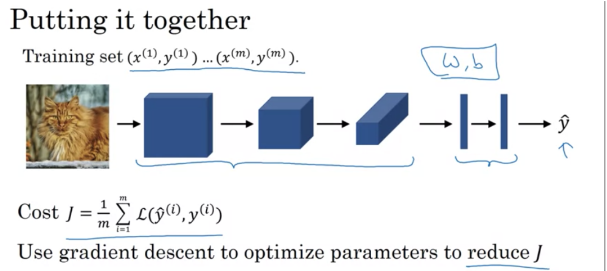

